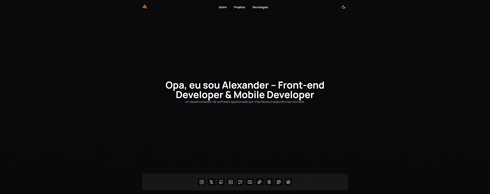
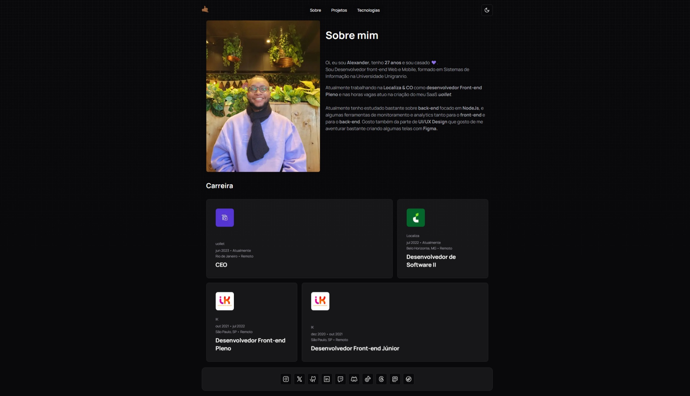
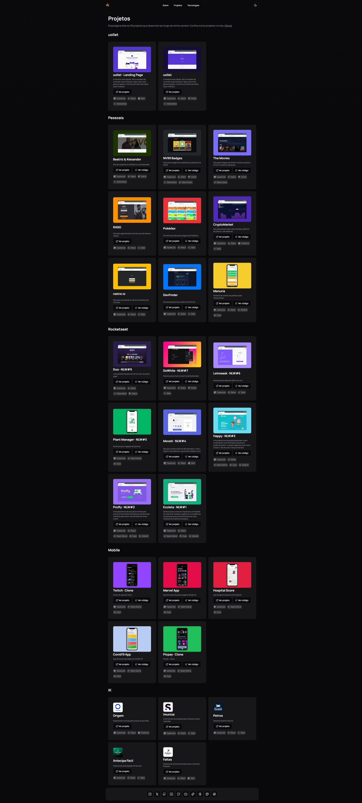
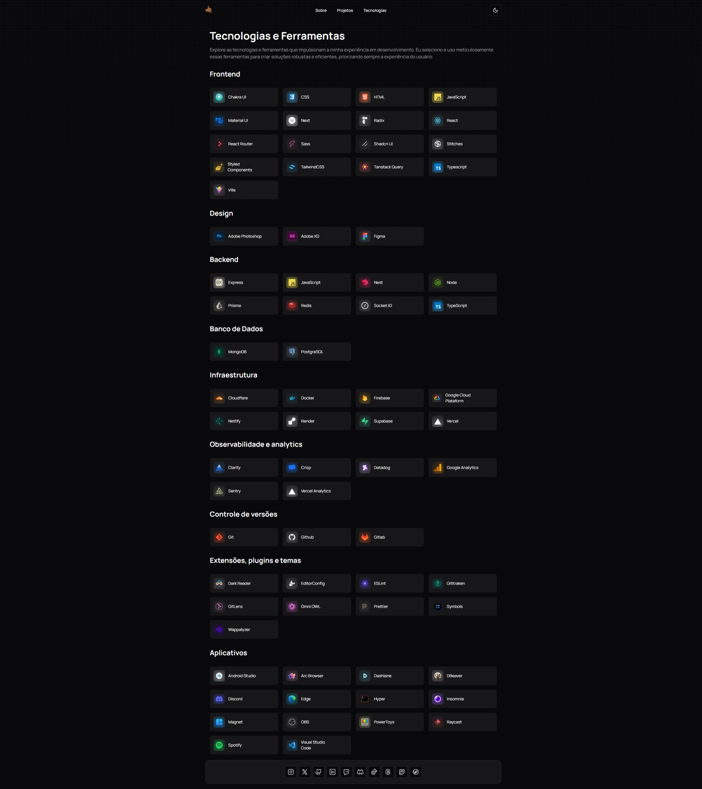

<h4 align="center">
   
 <b>Meu portfólio!</b>
</h4>

    
  
  
  

 

### :rocket: Tecnologias usadas
Esse projeto foi desenvolvido com as seguintes tecnologias:
- [ReactJS](https://pt-br.reactjs.org/)
- [Next](https://nextjs.org/)
- [Typescript](https://www.typescriptlang.org/)
- [TailwindCSS](https://tailwindcss.com/)
- [Shadcn/ui](https://ui.shadcn.com/)
- [Hygraph](https://hygraph.com/)

Extras:

- Main Libs
  - Para mais detalhes, veja o <kbd>[package.json](https://github.com/ialexanderbrito/ialexanderbrito.dev/blob/master/package.json)</kbd>

- Estilos
  - [EditorConfig](https://editorconfig.org/)
  - [ESLint](https://eslint.org/)
  - [Prettier](https://prettier.io/)

### 📱 Screen

<h4 align="center">
<h3>Tela principal</h3>

</h4>

<h3 align="center">
<h2>Tela Sobre</h2>

</h3>

<h3 align="center">
<h2>Tela Projetos</h2>

</h3>

<h3 align="center">
<h2>Tela Tecnologias</h2>

</h3>

### 💻 Visite

[Acesse aqui](https://ialexanderbrito.dev/)

### 📱 Social

Me acompanhe nas minhas redes sociais.

 

  

  

  

  

---

Feito com ❤️ by **Alexander** 🤙🏾
